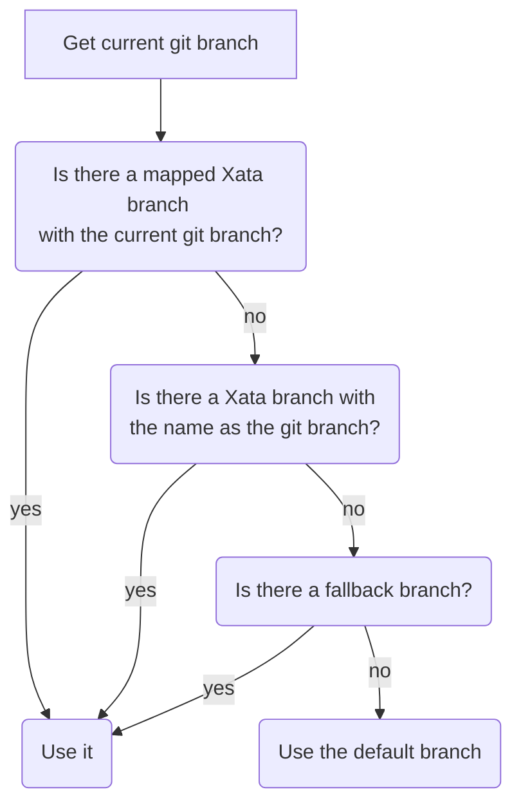

# Command Line Interface (CLI)

Xata provides a CLI as a convenience for developers. It is intended to provide feature parity with Xata's [Web UI](https://docs.xata.io/getting-started) (User Interface) to enable developers to build applications at **rapid pace** with **as little friction as possible**.

## Installation

Our CLI is distributed as an **[npm](https://www.npmjs.com/package/@xata.io/cli) package** and can be installed using npm if you've got [Node.js](https://nodejs.org/) installed. We will publish a more universal binary for Windows, macOS and Linux in the near future.


### Installing with npm

To install the Xata CLI globally, run the following command:

```sh
npm i --location=global @xata.io/cli
```

This will install the Xata CLI. We recommend installing it globally because it becomes much more convenient to work with: you can invoke a `xata` command from anywhere, instead of the more convoluted variant with a project-scoped installation (`npm run xata`), or an npx-based installation (`npx @xata.io/cli`). These alternative approaches also work according to your preference, but we recommend a global installation.

## Authentication

The Xata CLI authenticates with Xata using an environment variable called `XATA_API_KEY`, usually stored in a `.env` file in your project. If your project doesn't have one, running `xata auth login` will give you options to set one up. Specifically, you'll have these options:

- **Create a new API Key**. This will open your browser and, when you're logged in to Xata, allow you to create a new [API key](https://docs.xata.io/concepts/api-keys) for use with the CLI.

- **Use an existing API Key**. This will prompt for an existing key you have, which you can paste into your terminal. We recommend isolating keys per use-case, so creating a new one might be a good idea here.

## Initializing a Project

To initialize a new project, run `xata init` in the root of your project's directory.

- if you don't have a [workspace](https://docs.xata.io/concepts/workspaces), you will be prompted to create one.
- if you have workspaces, you'll be asked to choose one, or to create a new one.

A workspace is a logical grouping of databases, usually analogous to an organization or team, so this is the first step. Once you've chosen a workspace, you will be given the option to either create a new one, or use an existing one for your project. After choosing a workspace and a database, you're ready to go: the CLI will walk you through next steps. Specifically, it will:

- create a project configuration file in your current working directory (`.xatarc`).
- create or update your `.env` file to store a database-scoped API key. (At the time of writing these docs it'll actually store a personal API key, but this will change soon).
- ask you if you'd like to install the SDK and/or use the TypeScript/JavaScript code generator.

When you have a project set up, the Xata CLI will now be aware of your project's configuration, namely which workspace, database, and branch you've chosen. It will know this information by reading it from a new set of files created in your current working directory: `.xatarc` and `.env`. Let's discuss these briefly.

### `.xatarc`

This file contains information about your current Xata project, specifically its database URL, and preferred output path of the [generated Xata client](#code-generation) that you can use to interact with your database if you've chosen to use it. More about this in [code generation](#code-generation).

We recommend checking this file in to your version control system (Git, SVN, etc.) so that you can easily share your project's configuration among your team.

### `.env`

This file contains sensitive information and secrets that ought not be committed to version control. It is recommended that you add this file to `.gitignore`, so that it is not accidentally committed to version control. The Xata CLI appends secrets to this file, namely your API key and fallback branch. More on branches in the [git](#git-integration) section.

### Global Mode

In case you use the Xata CLI _outside_ of a project, where no `.xatarc` is present, you'll be using it in _global mode_. When using the CLI in global mode, you'll have to manually tell it which database you'd like it to work with. You can do this using the `--db [url]` flag. If you omit this flag, you will be interactively prompted to choose a database.

## Code Generation

We strongly recommend using the CLI to generate your Xata fetcher (sometimes called a _client_) for you. This will help make your queries to Xata predictable and safe, while also providing autocomplete and safety.

Once you have a generated Xata client, you can import it into your project and use it. The [SDK Playground](https://docs.xata.io/sdk/playground) in the Xata web interface can serve as a companion for you to build and test out your queries. Once you're happy with them, you copy and paste them into your project.

As your schema changes, running `xata codegen` will consistently refresh your auto-generated Xata client with the latest schema for your database branch.

## Branches & Git Integration

Xata is a _branchable_ database. Developers can checkout new branches of their database schemas, make changes safely, and merge them into their main branch. This triggers a zero-downtime migration. To learn more about branches, see the [branches](https://docs.xata.io/concepts/branches) section.

Some commands are integrated with git. Specifically, those related to branching. Xata uses the following algorithm in development in order to calculate which xata branch needs to be used:



The current git branch is used in the first two cases in the algorithm:

- if a git branch has been explicitly mapped to a Xata branch with `xata branches link` for example, the associated branch is used
- otherwise, if a Xata branch with the same name as the git branch exists, we use that.

If none of them apply, the **fallback branch** is used. This is a safety measure to avoid connecting to your production database. If you are developing a feature that doesn't require schema changes, you'll have a git branch, but not an associated Xata branch. In this case to prevent using the default Xata branch–which could be production–we allow specifying a `XATA_FALLBACK_BRANCH` in your local `.env` file. You can have a personal branch with your username for example.

If none of the above apply, the default Xata branch is used.

## Editing Your Database Schema

You can edit the schema in the CLI with `xata schema edit` but you can also quickly jump to the Web UI with `xata browse` and edit the schema there.

If you edit the schema in the CLI, the code generator will be used if it's configured after applying the schema changes. If you choose to edit the schema in the web UI, remember to execute `xata codegen` when you are back to your code.

## Next Steps

Now that your project is set up with the Xata CLI, and if you've opted to use code generation (recommended), we suggest exploring the [TypeScript/JavaScript SDK](https://docs.xata.io/sdk/getting-started) section of the documentation to get up to speed using it.
