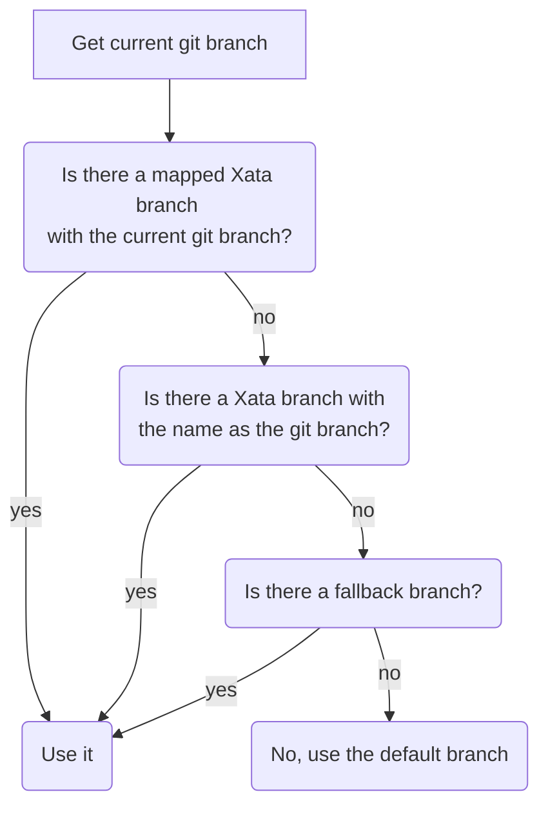

# Xata CLI

## Installing

The recommended way of installing the CLI is by installing it as an npm package globally:

```bash
npm install @xata.io/cli -g
```

Now you can just run `xata --help` to see all the available commands.

It's perfectly fine to install it locally in your project if you wish:

```bash
npm install @xata.io/cli --save-dev
```

## Authentication, API keys and projects

Almost all commands can work in two different modes: globally or scoped to a project. You can configure a project with `xata init`. This will create a `.xatarc` file (although `.xatarc.json` and `package.json` are also supported) and an `.env` file.

- The project configuration file contains some preferences and information, including the `databaseURL`.
- The `.env` file contains an API key and optionally a fallback branch name. More about this later.

When working in _global mode_, commands won't know which database you want to use, because there's no project configuration file, and thus, no `databaseURL` configured. So, you can either pass a `--db` flag to specify the database URL, or just don't pass any argument and you will be prompted interactively to select a workspace, then a database, and depending on the command, a branch name.

In order to configure authentication for the _global mode_, you have to authenticate first using `xata auth login`. This will guide you through the process to generate a new global API key that will be stored in `~/.config/xata/credentials`.

## Configuring a project

In ordert to configure the CLI in a project you'll run `xata init --db=https://{workspace}.xata.sh/db/{database}`. The flag `--db` is not mandatory but recommended, because this way you won't be asked for the workspace/database and thus, a global API key is not required.

This command will ask you a few questions and will run a few operations:

- It will create a project configuration file (`.xatarc`).
- It will create or update your `.env` file to store a database-scoped API key. (At the time of writing these docs it'll actually store a personal API key, but this will change soon).
- It will ask you if you want to install the SDK and/or use the TypeScript/JavaScript code generator.

## Code generation

You can use the Xata SDK (`@xata.io/client`) directly or with code generation. The benefit of using code generation is that you'll have a Xata client with specific types and classes for your database schema. This is great for TypeScript because it ensures type safety, but also for JavaScript because you can benefit from its type definitions if you use development tools such as IDEs or text editors that support them.

Code generation will be executed automatically in some cases, such as when creating a new Xata branch, but you can also invoke it directly with `xata codegen` if you've done change to the schema through the UI or the REST API and you want to update your local generated code.

## Git integration

Some commands are integrated with git. Specifically those related to branching. Xata uses the following algorithm in development in order to calculate which xata branch needs to be used:



As you can see, the current git branch is used in the first two cases in the algorithm:

- If a git branch has been explicitely mapped to a xata branch with `xata branches link` for example, the associated branch is used.
- Else, if a xata branch with the same name as the git branch exists, it is used.

If none of them apply, a fallback branch is used. This is useful to avoid connecting to your production database. If you are developing a feature that doesn't require schema changes, you'll have a git branch, but not an associated xata branch. In this case to prevent using the default xata branch, that could be production, you can specify in your `.env` file a `XATA_FALLBACK_BRANCH`. You can have a personal one with your username for example.

If none of the above apply, the default Xata branch is used.

## Editing the database schema

You can edit the schema in the CLI with `xata schema edit` but you can also quickly jump to the web UI with `xata browse` and edit the schema there.

If you edit the schema in the CLI, the code generator will be used if it's configured after applying the schema changes. If you choose to edit the schema in the web UI, remember to execute `xata codegen` when you are back to your code.
