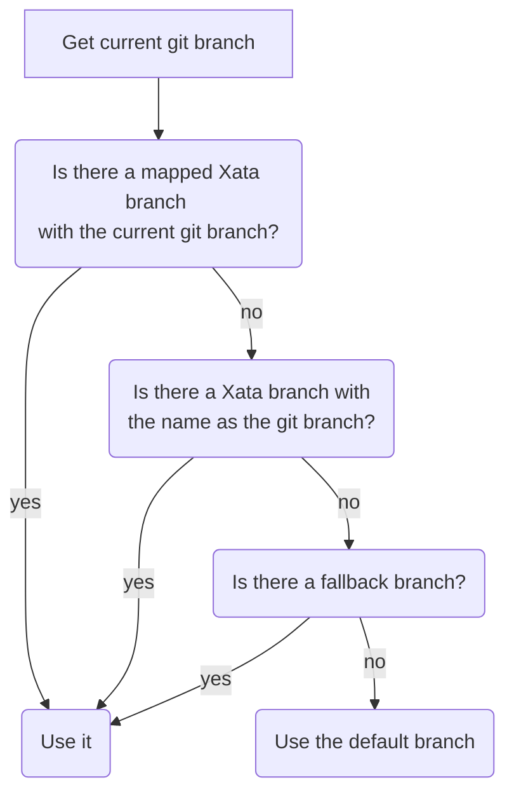

# Command Line Interface (CLI)

Xata provides a CLI as a convenience for developers. It is intended to provide feature parity with Xata's [Web UI](https://docs.xata.io/getting-started) (User Interface) to enable developers to build applications at **rapid pace** with **as little friction as possible**.

## Installation

Our CLI is distributed both as an **[npm](https://www.npmjs.com/package/@xata.io/cli) package** for developers who work with Node.js, and a **cross-platform binary** for those who don't. Below, you'll find commands that you can copy and paste into your platform's shell that will help you install the CLI on your specific platform.


### Installing with npm

To install the Xata CLI globally, run the following command:

```sh
npm i --location=global @xata.io/cli
```

This will install the Xata CLI. We recommend installing it globally because it becomes much more convenient to work with, having you invoke a `xata` command instead of the more convoluted alternative with a project-scoped installation (`npm run xata`), or an npx-based installation (`npx @xata.io/cli`). The alternative approaches also work depending on your preference.

### Installing the Binary without npm

Our CLI can also be installed as a cross-platform binary for our users who do not have `npm` installed on their systems. Depending on your platform of choice, here are installation instructions to get you started.

#### macOS and Linux

Paste the following command into your terminal and hit Enter.

```sh
curl -L  https://xata.io/install.sh | sh
```

This command fetches the latest CLI install script and runs it in your shell. Piping a script to bash can raise eyebrows, so the code for this is open and can be visited in your browser in case you find your eyebrows raised.

#### Windows

Paste the following command into your terminal and hit Enter.

```powershell
iwr https://xata.io/install.ps1 -useb | iex
```

## Authentication

To authenticate your CLI installation, run `xata auth login`. Here, you will be presented with a couple of options:

- **Create a new API Key** will open your browser and, when you're logged in to Xata, allow you to create a new [API key](https://docs.xata.io/concepts/api-keys) for use with the CLI.
- **Use an existing API Key** will prompt for an existing key you have, which you can paste into your terminal. We recommend isolating keys per use-case, so creating a new one might be a good idea here.

## Initializing a Project

To initialize a new database, run `xata init` in your project's directory.

- if you don't have a [workspace](https://docs.xata.io/concepts/workspaces), you will be prompted to create one.
- if you have workspaces, you'll be asked to choose one, or to create a new one.

A workspace is a logical grouping of databases, usually analogous to an organization or team, so this is the first step. Once you've chosen a workspace, you will be given the option to either create a new one, or use an existing one for your project.

After choosing a workspace and a database, you're ready to go: the CLI will walk you through next steps, ultimately leading you to code generation.

## Code Generation

We strongly recommend using the CLI to generate your Xata fetcher (sometimes called a _client_) for you. This will help make your queries to Xata predictable and safe, while also providing autocomplete and safety.

Once you have a generated fetcher, you can use import it into your project and using it. The `.` character (object property access in JavaScript) will provide autocompletion hints. You can now also use the [SDK Playground](https://docs.xata.io/sdk/playground) in the Xata web interface to test out your queries and then copy and paste them into your applications.

As your schema changes, running `xata codegen` will consistently refresh your auto-generated Xata client with the latest schema for your database branch.

## Git Integration

Some commands are integrated with git. Specifically, those related to branching. Xata uses the following algorithm in development in order to calculate which xata branch needs to be used:



The current git branch is used in the first two cases in the algorithm:

- if a git branch has been explicitly mapped to a Xata branch with `xata branches link` for example, the associated branch is used
- otherwise, if a Xata branch with the same name as the git branch exists, we use that.

If none of them apply, the **fallback branch** is used. This is a safety measure to avoid connecting to your production database. If you are developing a feature that doesn't require schema changes, you'll have a git branch, but not an associated Xata branch. In this case to prevent using the default Xata branch–which could be production– we allow specifying a `XATA_FALLBACK_BRANCH` in your local `.env` file. You can have a personal branch with your username for example.

If none of the above apply, the default Xata branch is used.

## Editing Your Database Schema

You can edit the schema in the CLI with `xata schema edit` but you can also quickly jump to the Web UI with `xata browse` and edit the schema there.

If you edit the schema in the CLI, the code generator will be used if it's configured after applying the schema changes. If you choose to edit the schema in the web UI, remember to execute `xata codegen` when you are back to your code.

## Next Steps

Now that your project is set up with the Xata CLI, and if you've opted to use code generation (recommended), we recommend exploring the [TypeScript/JavaScript SDK](https://docs.xata.io/sdk/getting-started) section of the documentation to get up to speed using it.
